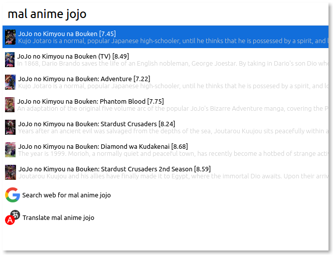

# Cerebro MyAnimeList

> MyAnimeList plugin for Cerebro

## Usage

In Cerebro, type `mal` then select either `anime` or `manga` then press
<kbd>enter</kbd> and write the anime/manga title.

With the results you can:

* Press Enter to open it's URL
* Press Tab to change the current input to it's URL
* Press <kbd>cmd+c</kbd> to copy it's URL to clipboard

## Related

* [Cerebro](http://github.com/KELiON/cerebro) – main repo for Cerebro app;

## License

MIT © [Lubien](http://lubien.me)
